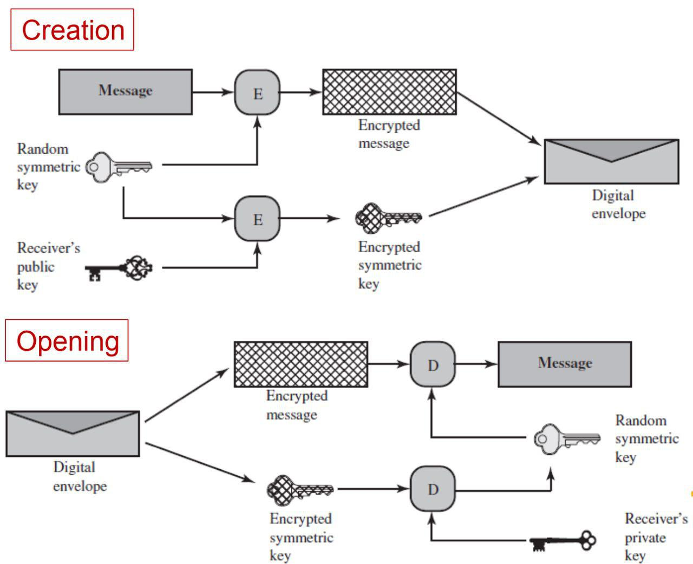

# Envelope de Segurança de Dados




> O projeto tem como objetivo praticar os conhecimentos de segurança em sistemas criando um gerenciador de envelopes digitais, para isso a aplicação fornece uma interface que irá criar e abrir esses envelopes. Em um arquivo de configuração são definidos o par de chaves RSA privada e pública do destinatário e o algoritmo simétrico que será utilizado na cifragem/decifragem do envelope.

## 🤓 Introdução:

Os envelopes digitais são uma técnica de segurança amplamente utilizada para proteger informações sensíveis durante o armazenamento, transmissão e acesso. Eles fornecem confidencialidade, autenticidade e integridade dos dados, garantindo que somente partes autorizadas possam acessar o conteúdo. Para isso a informação passará pelos processos de envelopamento no remetente e abertura no destinário. Nesse projeto vamos explorar esse mecanismo utilizando o algoritmo de chave assimétrica RSA e os algoritmos simétricos AES, DES ou RC4. A chave assimétrica será usada para criptografar a chave simétrica, que, por sua vez, será usada para criptografar o conteúdo do envelope.

### 📩 Envelopamento - Remetente

- Converta o arquivo ou a mensagem em claro em uma representação binária.
- Gere uma chave simétrica temporária/aleatória para o algoritmo simétrico escolhido.
- Utilize o algoritmo simétrico para criptografar o conteúdo utilizando a chave simétrica gerada.
- Cifre a chave simétrica temporária utilizando a chave pública do destinatário (parte que irá abrir o envelope).

### 📃 Abertura - Destinarário

- Utiliza sua chave privada para descriptografar a chave simétrica.
- Utilize a chave simétrica para descriptografar o conteúdo do envelope e obter o conteúdo original.

## 📖 Referências

- [Criptografia Moderna (Slides)](/criptografia-moderna.pdf)
- [Key Encapsulation Mechanism](https://en.wikipedia.org/wiki/Key_encapsulation_mechanism)
- [Public Key Cryptography](https://en.wikipedia.org/wiki/Public-key_cryptography)
- [Node Crypto Library](https://nodejs.org/api/crypto.html)

## 🪚 Feito Com:


## 💻 Pré-requisitos

Antes de começar, verifique se você atendeu aos seguintes requisitos:

- [`< Git >`](https://git-scm.com/)
- [`< NodeJS 18+ >`](https://nodejs.org/)

## 📥 Baixando e Compilando o Projeto

Para clonar e baixar as dependências e compilar o projeto, utilize os comandos:

```
git clone https://github.com/pumba-dev/data-security-envelop.git

cd data-security-envelop

npm run build
```

## 📝 Gerando Par de Chaves RSA

Para gerar um par de chaves pública e privada basta utilizar o comando abaixo:

```
npm run keygen
```

Este comando irá gerar dois arquivos (public_key.pem e private_key.pem) na pasta [/rsa-keys](./rsa-keys/) localizada na raiz do projeto.

## ⚙️ Configurando a Aplicação

Para definir os algoritmos e chaves utilizados no envelope, atualize os dados no arquivo de configuração [`envelope-config.json`](/envelope-config.json) no diretório raiz do projeto.

| Params              | Type   | Default        | Description                                                                      |
| ------------------- | ------ | -------------- | -------------------------------------------------------------------------------- |
| `clearText`         | String | clear-text     | Nome do arquivo que contem o texto em claro para envelopamento.                  |
| `rsaPublicKey`      | String | public_key     | Nome do arquivo de chave pública utilizado para criptografia da chave simétrica. |
| `rsaPrivateKey`     | String | private_key    | Nome do arquivo de chave privada utilizado para criptografia da chave simétrica. |
| `simetricAlgorithm` | String | AES            | Algoritmo simétrico utilizado para criptografia da mensagem (AES, DES ou RC4)    |
| `envelopeKey`       | String | encrypted_key  | Nome do arquivo que contem a chave criptografada para abertura no remetente      |
| `envelopeMessage`   | String | encrypted_file | Nome do arquivo que contem a mensagem criptografada para abertura no remetente   |

### Textos em Claro

- Para adicionar um novo texto em claro para o envelopamento, basta criar ou alterar um arquivo .txt localizado na pasta [/clear-texts](./clear-texts/) na raiz do projeto. Por padrão, o algoritmo está configurado para ler o arquivo de nome `clear-text`.

### Chaves RSA

- As chaves RSA estão localizadas na pasta [/rsa-keys](./rsa-keys/) na raiz do projeto. Você pode [gerar novas chaves](#📝-gerando-par-de-chaves-rsa) ou adicionar um novo par de chaves e especifica-los no arquivo de configuração.

### Mensagens Cifradas e Decifradas

- Os envelopes criados serão salvos na pasta [/encrypted-messages](./encrypted-messages/). Por padrão o algoritmo está configurado para salvar os envelopes como `encrypted_file` e `encrypted_key` e ler estes mesmos envelopes durante a decifragem. Para realizar a decifragem de um envelope diferente, basta adicionar o par de arquivos chave e mensagem na pasta de envelopes e especifica-los no arquivo de configuração. A decifragem desses envelopes serão salvos na pasta [/decrypted-messages](./decrypted-messages/).

## 🚀 Gerando e Abrindo um Envelope

Para gerar um envelope, utilize o comando:

```
npm run enveloping
```

Para abrir o envelope, utilize o comando:

```
npm run opening
```

## 📫 Contribuindo com o Projeto

Para contribuir com o projeto, siga estas etapas:

1. Bifurque este repositório.
2. Crie um branch: `git checkout -b <nome_branch>`.
3. Faça suas alterações e confirme-as: `git commit -m '<mensagem_commit>'`
4. Envie para o branch original: `git push origin main`
5. Crie a solicitação de pull.

Como alternativa, consulte a documentação do GitHub em [como criar uma solicitação pull](https://help.github.com/en/github/collaborating-with-issues-and-pull-requests/creating-a-pull-request).

## 🤝 Colaboradores

As seguintes pessoas contribuíram para este projeto:

<table>
  <tr>
  <!-- Pumba Developer -->
    <td align="center">
      <a href="https://github.com/pumba-dev">
        <br>
        <sub>
          <b>Pumba Developer</b>
        </sub>
      </a>
    </td>
        <!-- Elyvya Teles -->
    <td align="center">
      <a href="https://github.com/eluvya">
        <br>
        <sub>
          <b>Elyvya Teles</b>
        </sub>
      </a>
    </td>
  </tr>
</table>

## 💰 Donate

[](https://picpay.me/pumbadev)

## 📝 Licença

Copyright © 2023 Pumba Developer

[⬆ Voltar ao topo](#)<br>
